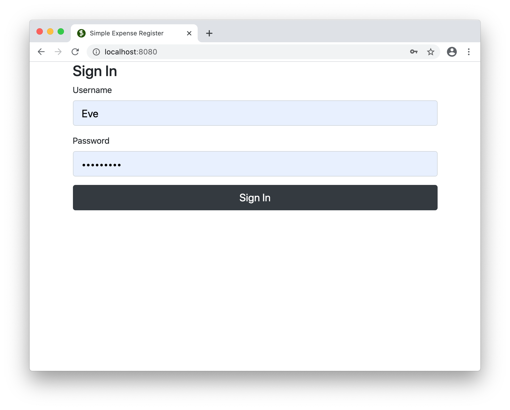
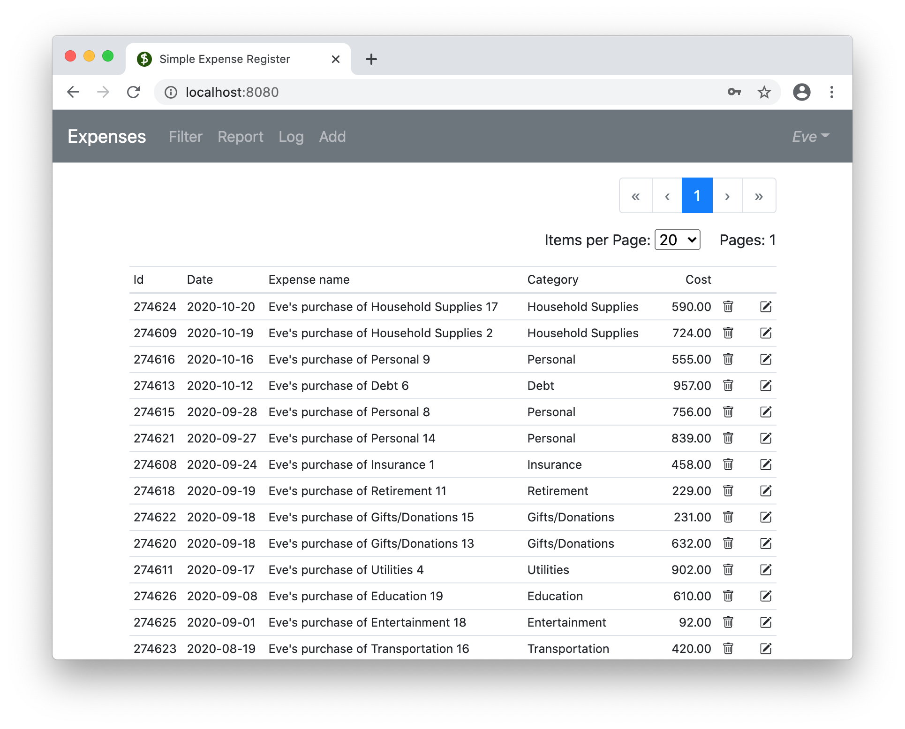
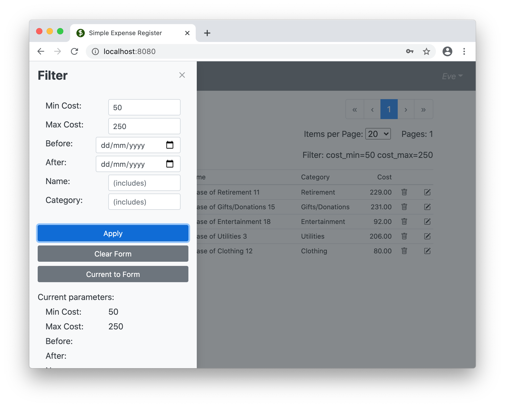
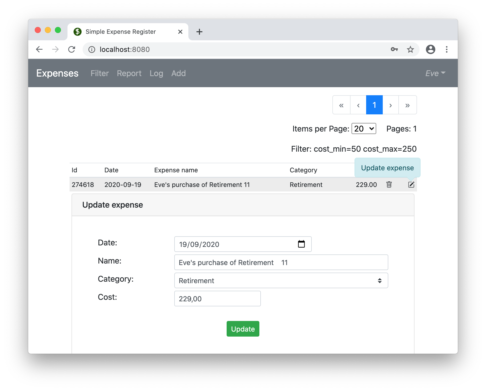
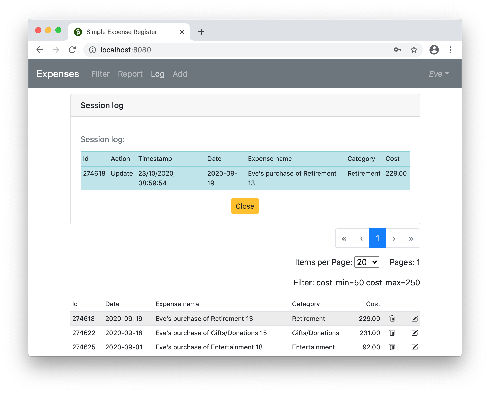

# ExR

Simple Expense Register.
Demo application to document and manage users expenses.

(asdf#anchors-in-markdown)

Key features:
* Front-end: Single Page Application : Vue.js
* Back-end: Django Rest Framework
* End-to-end CRUD
* Rest pagination and filtering, Authorization, 


Set-up procedure defines following test users in the database:

UserID | Password
------------ | -------------
Eve | Pass4Eve!
Adam | Pass4Adam!

# <a name="CONTENT">Content:<a>

* [TODOs for the next version (areas for improvement)](#TOC1)
* [Back-end development enviroment set-up](#TOC2)
* [Front-end developent enviroment set-up](#TOC3)
* [What you can expect. A couple of screenshots](#TOC4)
  
# <a name="TOC1">TODOs for the next version (areas of improvement) </a>
[back to menu](#CONTENT)
- ### Must-do
  - [ ] Witraw from dynamic Report tables refreshes on every expense add/delete/update operations (it overloads database). Add Refresh button instead.
- ### Good-to-do
  - [ ] Apply currency formatting for money values ($1,000 instead of 1000)
  - [ ] More consistent button colors and styles for different windows
  - [ ] Input box for page entered by user from keyboard (not only selected with mouse)
  - [ ] Reconsider and refactor 'Expensegrid.vue'. This file became too big.
  - [ ] Initial "Items per Page:" selection box does not show default value. Correct.
- ### Potential future functionality extensions
  - [ ] Explicit currencies (USD, PLN, etc.)
  - [ ] Interface to manage cost categories  (and potencially curriencies)
  - [ ] Nicer visual design for "Items per Page:" "Pages:" and "Filter:" elements

# <a name="TOC2">Back-end development enviroment set-up</a>
[back to menu](#CONTENT)

Prerequisites, apps availabe on computer:
 - Python3 
 - curl (optionally)
 
1. Download code and set-up python virtual enviroment
```
git clone https://github.com/ka-r-ol/ExR.git

cd ExR

python3 -m venv venv
source venv/bin/activate
pip install pip --upgrade
pip install -r requirements.txt
```
2. Set-up database structure
```
cd server
python manage.py makemigrations
python manage.py migrate 
```

3. Upload randomly generated expenses to the datbase and set-up two test users (mentioned above)
```
./load_sample_data.sh
```

4. Run local server:
```
python manage.py runserver
```

5. Assure the server serves the data:
Run tests: 
```
curl -u Eve:Pass4Eve! http://localhost:8000/api/v1/categories | python -m json.tool

curl -u Eve:Pass4Eve! http://127.0.0.1:8000/api/v1/expenses | python -m json.tool

curl -u Eve:Pass4Eve! "http://127.0.0.1:8000/api/v1/expenses?cost_max=150&cost_min=50" | python -m json.tool

```

# <a name="TOC3">Front-end developent enviroment set-up</a>
[back to menu](#CONTENT)

1. Go to ExR directory (the one containing venv subdir)

Make sure you are in the virutal env (source venv/bin/activated )

2. Install nodes virtual env tool:
```
pip install nodeenv
```
3.  Concatenate nodes virutal env with python virualenv:
```
nodeenv -p
```
4. Install Vue enviroment
```
cd client
npm install
```

5. Add following packages to the enviroment
install following packages:
```
npm install axios
npm install vue bootstrap-vue bootstrap
npm install vuex --save
```

### Run and Test SPA

6. Open chrome in development mode:
Command :

It's a mac version. Other operation systems may require adaptation of the command:
```
open -n -a /Applications/Google\ Chrome.app --args --user-data-dir="/tmp/someFolderName" --disable-web-security
```
in the client sub-directory there is a script: start_dev_chrome.sh (MAC only).

7. Start vue dev enviroment:
```
npm run dev
```

8. switch to browser (chrome), log in and enjoy the application

# <a name="TOC4">What you can expect </a>
[back to menu](#CONTENT)

## A couple of screenshots

Login screen:


Expenses list:


Filter sidebar:


Update form:


Session log:

